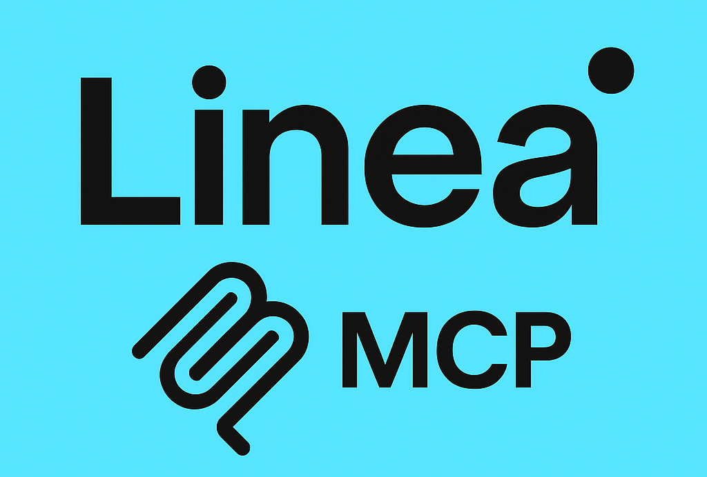

# Linea MCP Server

<div align="center">
  
</div>

A Model Context Protocol (MCP) server that provides on-chain tools for AI applications to interact with the Linea blockchain.

[](https://www.npmjs.com/package/linea-mcp)
[](https://opensource.org/licenses/MIT)

## Overview

Linea-MCP extends any MCP client's capabilities by providing tools to interact with the Linea blockchain, an Ethereum Layer 2 scaling solution using zero-knowledge proof technology. This server enables AI assistants like Claude, Cursor, and other MCP-compatible clients to perform blockchain operations through natural language requests.

### Key Features

- **Wallet Management**: Retrieve addresses and check balances
- **Token Operations**: Transfer ERC20 tokens, check balances, list tokens
- **Smart Contract Interactions**: Deploy and call contracts 
- **NFT Management**: List and transfer NFTs
- **Bridge Operations**: Bridge assets between Ethereum and Linea
- **DeFi Integrations**: Interact with DeFi protocols
- **Verax Integration**: Verify identity with Linea Verax attestations
- **Linea ENS**: Resolve and manage Linea ENS names

[See examples.md](examples.md) for detailed usage examples.

## Quick Start

### Prerequisites

- Node.js (v16+)
- npm or yarn
- Access to Linea RPC endpoints

### Installation Options

#### Option 1: Quick Install (Global Package)

```bash
# Install globally
npm install -g linea-mcp

# Create a basic .env file
echo "LINEA_MAINNET_RPC_URL=https://rpc.linea.build
LINEA_TESTNET_RPC_URL=https://rpc.sepolia.linea.build
WALLET_PRIVATE_KEY=your_wallet_private_key_here
INFURA_API_KEY=your_infura_key_here" > .env

# Start the server
linea-mcp
```

#### Option 2: Development Install (From Source)

```bash
# Clone the repository
git clone https://github.com/qvkare/linea-mcp.git
cd linea-mcp

# Install dependencies
npm install

# Configure environment
cp .env.example .env
# Edit .env with your configuration

# Build and start
npm run build
node dist/index.js  # Using Node directly is more reliable than npm start
```

## Integration with MCP Clients

This MCP server can be integrated with any MCP-compatible client including Cursor, Claude Desktop, Windsurf, Cline, and other AI assistants.

### General Configuration Steps

1. Find your client's MCP configuration file location
2. Add a Linea MCP server configuration section
3. Configure the server using one of the following approaches:

#### Option 1: Using Global Installation (Simple)

```json
{
  "mcpServers": {
    "linea": {
      "command": "npx",
      "args": ["linea-mcp@latest"],
      "env": {
        "PORT": "3000",
        "LINEA_MAINNET_RPC_URL": "https://rpc.linea.build",
        "LINEA_TESTNET_RPC_URL": "https://rpc.sepolia.linea.build",
        "INFURA_API_KEY": "your_infura_key",
        "ALCHEMY_API_KEY": "your_alchemy_key",
        "PRIVATE_KEY_ENCRYPTION_KEY": "your_encryption_key_please_change",
        "WALLET_PRIVATE_KEY": "your_wallet_private_key_or_mnemonic",
        "NODE_ENV": "development",
        "ETHEREUM_RPC_URL": "https://mainnet.infura.io/v3/your_infura_key",
        "ETHEREUM_TESTNET_RPC_URL": "https://sepolia.infura.io/v3/your_infura_key"
      }
    }
  }
}
```

#### Option 2: Using Local Installation (Recommended for Development)

```json
{
  "mcpServers": {
    "linea": {
      "command": "node",
      "args": ["/absolute/path/to/linea-mcp/dist/index.js"],
      "cwd": "/absolute/path/to/linea-mcp",
      "env": {
        // Same environment variables as Option 1
        "PORT": "3000",
        "LINEA_MAINNET_RPC_URL": "https://rpc.linea.build",
        // ... other variables from Option 1
      }
    }
  }
}
```

> **Important Note**: When using a local installation, directly running the JavaScript file with Node.js provides more reliable communication than using npm scripts.

### Client-Specific Locations

- **Cursor**: 
  - Windows: `%APPDATA%\Cursor\mcp.json`
  - macOS: `~/Library/Application Support/Cursor/mcp.json`
  - Linux: `~/.config/Cursor/mcp.json`

- **Claude Desktop**: 
  - Windows: `%APPDATA%\Claude\claude_desktop_config.json`
  - macOS: `~/Library/Application Support/Claude/claude_desktop_config.json`
  - Linux: `~/.config/Claude/claude_desktop_config.json`

- **Other Clients**: Refer to your client's documentation for MCP configuration location

## Troubleshooting

### Common Issues

1. **"No tools available" or "Client closed" errors**:
   - Use direct Node.js execution (`"command": "node", "args": ["/path/to/dist/index.js"]`) instead of npm scripts
   - Ensure environment variables are configured correctly
   - Restart your client after configuration changes

2. **JSON parsing errors in logs**:
   - These indicate communication protocol issues
   - Using direct Node.js execution usually resolves these problems
   - Make sure the `cwd` property is set correctly

3. **Complete troubleshooting guide:**
   - See [docs/troubleshooting.md](docs/troubleshooting.md) for detailed solutions to common problems

## Available Tools

The server provides tools across multiple categories:

- **Wallet**: Address management, balance checking, fund transfers
- **Tokens**: ERC20 transfers, balance checking, token information
- **Contracts**: Deployment and interaction
- **NFTs**: Listing and transfers
- **Bridge**: Asset bridging between Ethereum and Linea
- **DeFi**: Liquidity pools, token swaps, yield farming
- **ENS**: Name resolution and record management
- **Verax**: Identity verification

For a complete list of tools and their usage, see [docs/tools.md](docs/tools.md).

## Security Considerations

- Never share your private keys or seed phrases
- Use environment variables for sensitive configuration
- Test extensively with testnet before using on mainnet

## License

This project is licensed under the MIT License - see the LICENSE file for details.
